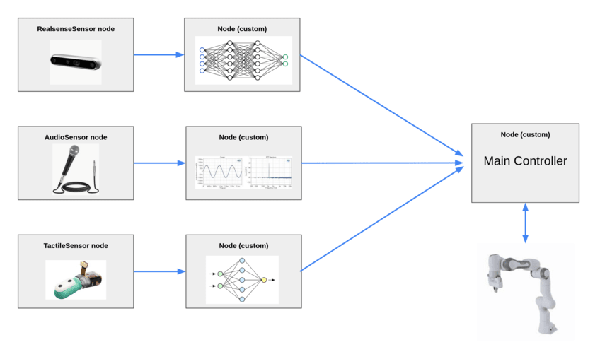

# roboflex

Roboflex is a c++/python library for distributed robotics. Roboflex is designed for:

1. Trivial installation: the core library has no dependencies other than c++ 20.
2. Ease of use: no non-programming-language files and configurations.
3. Performance: supports 0-copy xtensors and eigen in c++.
4. Python interaction: easily scriptable with python. Still performant.
5. You control main(): Roboflex is a library, not a framework.

Roboflex supports any wire transport, starting with ZMQ and MQTT.

## Messaging

The core of roboflex is the message format. We believe that dynamic, self-describing messages are extremely important for truly distributed development. To that end, we choose FlexBuffers as the message format, with a few additions. See [MESSAGEFORMAT.md](core/MESSAGEFORMAT.md).

## Building

See [BUILDING.md](BUILDING.md) for how to build parts or all of roboflex.

## Modules and Directory Structure

Roboflex.core takes care of Message and Node classes, eigen/xtensor serialization, flexbuffer creation and reading, and python compatibility. Everything outside of roboflex.core is a sensor, actuator, robot, or utility node - roboflex aims to make it easy to create and support devices and tools. These are the folders/modules under roboflex, and what they do:

* [core](core/): Serialization, Node and Message based classes, etc.

Utilities:
publish metrics for a graph.
* [transport](transport/): Folder containing sub-modules that perform wire transport.
    * [transport/mqtt](transport/mqtt/): MQTT-based transport. Thin wrapper around mosquitto.
    * [transport/zmq](transport/zmq/): ZMQ-based transport. Thin wrapper around zero-mq. 
* [visualization](visualization/): Various visualizers using Simple Directmedia Layer.
* [metrics_central](metrics_central/): Visualizer for realtime graph performance measurements per node and connection, such as frequency, messaging latency, bytes/sec, etc. And a Profiler node that can publish to it. Requires transport/mqtt to publish graph metrics to.
* More to come! Any requests?

Devices:
* [dynamixel](dynamixel/): Support for dynamixel motors.
* [realsense](realsense/): Support for Intel Realsense cameras (tested on 435).
* [webcam_uvc](webcam_uvc/): Support for usb-connected, uvc-compatible webcams.
* More to come! Any requests?

Compound [examples](examples/): (Examples that use more than one module):
* [examples/webcam_tv](examples/webcam_tv/): Webcam television! Run a webcam sensor, display the output.
* [examples/webcam_tv_distributed](examples/webcam_tv_distributed/): Run a webcam sensor, broadcast over zmq, display the output.
* [examples/realsense_tv](examples/realsense_tv/): Realsense television! Run a realsense sensor, display the output.

## Real quick

Run [core/examples/cpp/tensors_0.cpp](core/examples/cpp/tensors_0.cpp) to see a quick example, in c++, of running a producer sending xtensor messages to a consumer in a single thread.

    bazel run -c opt //core/examples/cpp:tensors_0