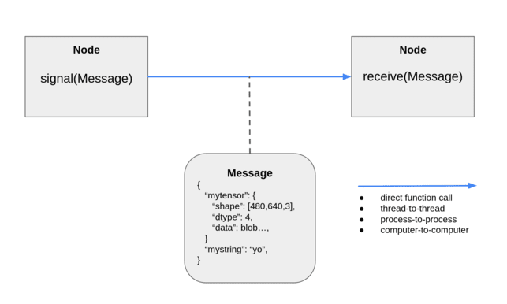

# roboflex.core

At its core, roboflex is a library to make `Node`s that create, signal, and receive `Message`s to and from other nodes, in a distributed manner.

Roboflex.core defines what a `Message` is and what a `Node` is. It provides serialization services for eigen and xtensor. It provides a small library of core message types and useful Node sub-classes. The core only supports sending messages via direct function call to other nodes; the nodes in transport/ (zmq and mqtt so far) support sending messages from one thread to another, from one process to another, and from one computer to another via multiple methods.

One node may connect to multiple downstream nodes, supporting the pub-sub pattern.

## Basic Types

### Message

A roboflex Message is defined as:
1. An 8-byte header. The first four bytes are the letters 'RFLX', and the next four bytes
are a uint32, which is the size of the message in bytes (including the header).
2. A data portion, encoded in flexbuffers.h. Please see [MESSAGEFORMAT.md](MESSAGEFORMAT.md).
3. roboflex.core provides the Message class to facilitate this, as well as meta data and 0-copy functionality. This class is designed to be inherited. Please see [core_messages.h](core_messages/core_messages.h) for examples.

### Node

A roboflex Node represents a basic unit of computation. Nodes can connect to other nodes, can signal Messages, and can receive them. RunnableNode inherits from Node, and adds the ability to run a function in a thread. Both Node and Runnable are designed to be inherited: in order to perform custom logic on message reception, custom nodes should inherit from Node and override receive. In order to run in a thread, custom nodes should inherit RunnableNode and override child_thread_fn.

#### Nodes are designed for sub-classing, in python:

    class MyNode(roboflex.Node):
        def receive(self, msg):
            signal(somenewmsg)
    
    # or, to make a runnable (root) node that runs in a thread:

    class MyRunnable(roboflex.RunnableNode):
        def child_thread_fn(self):
            do whatever
        def start(self):
            override if you want, probably not

#### and in c++:

    struct MyNode: public roboflex::core::Node {
        MyNode(): Node("n007") {}
        void receive(core::MessagePtr m) override {
            std::cout << get_name() << " " << m->to_string() << std::endl;
            signal(m);
        }
    };

    struct MyRunnableNode: public roboflex::core::RunnableNode {
        MyRunnableNode(): roboflex::core::RunnableNode("n121") {}
        void child_thread_fn() override {
            // maybe read from a sensor in a loop? control a robot?
        }
    };

    // The examples in roboflex/core/core_nodes explore subclassing further.

## Building (Only if you're doing c++)

    mkdir build && cd build
    cmake ..
    make
    make install

## Install for python

    pip install roboflex
    

## Just Show Me The Code Example (in python):

    import time
    import numpy as np
    from roboflex import FrequencyGenerator, MapFun, MessagePrinter, CallbackFun

    # This example shows how to create a graph of nodes that pass messages containing
    # numpy tensors (that can be interpreted at the c++-level as xtensor or eigen 
    # objects) between each other in a chain.

    # ----------- 
    # create nodes of the graph

    # The first node will signal at 2 hz. FrequencyGenerator is a library node that
    # simply signals a BlankMessage at a given frequency. It runs in a thread, and must
    # be started and stopped.
    frequency_generator = FrequencyGenerator(2.0)

    # Next, this MapFunction (a node that maps a message to another message) node 
    # creates a message containing a numpy tensor. The python dict will be 
    # encapsulated into a DynoFlex message, and be passed to the next node in 
    # the graph.
    tensor_creator = MapFun(lambda m: {"t": np.ones((2, 3)) * m.message_counter})

    # These nodes print stuff out.
    message_printer = MessagePrinter("MESSAGE IS:")
    tensor_printer = CallbackFun(lambda m: print("TENSOR IS:", type(m["t"]), m["t"].shape, m["t"].dtype, "\n", m["t"]))

    # ----------- 
    # connect nodes of the graph. It's easy to distribute the graph into
    # multiple cpus using nodes in roboflex/transport.
    #
    # 'frequency_generator > tensor_creator' is syntactic sugar for
    # 'frequency_generator.connect(tensor_creator)'.
    #
    frequency_generator > tensor_creator > message_printer > tensor_printer

    # ----------- 
    # start the root node (the other nodes, in this case, will run in the root node's thread).
    frequency_generator.start()

    # ----------- 
    # go for a while
    time.sleep(3)
        
    # ----------- 
    # stop the root node
    frequency_generator.stop()

## Examples

see [examples/README.md](examples/README.md)
