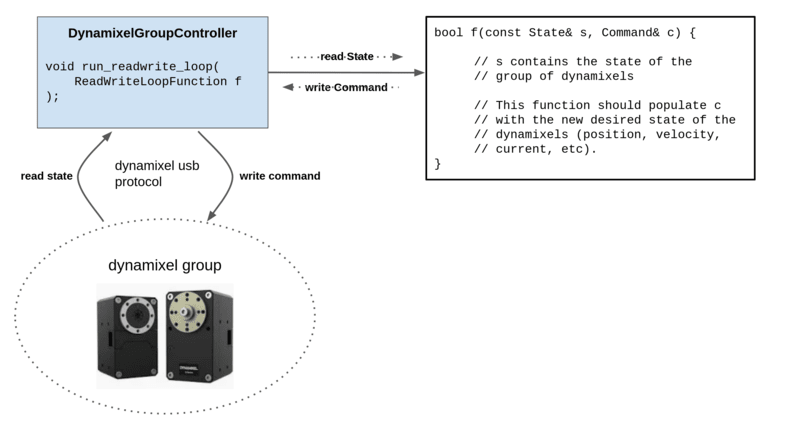
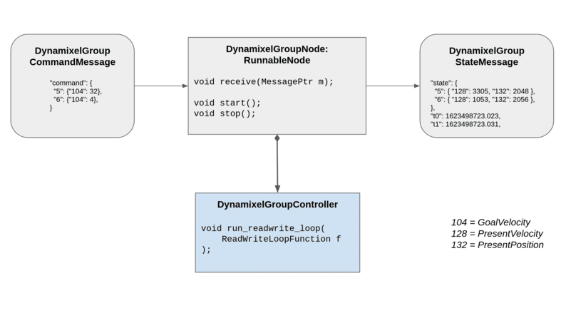
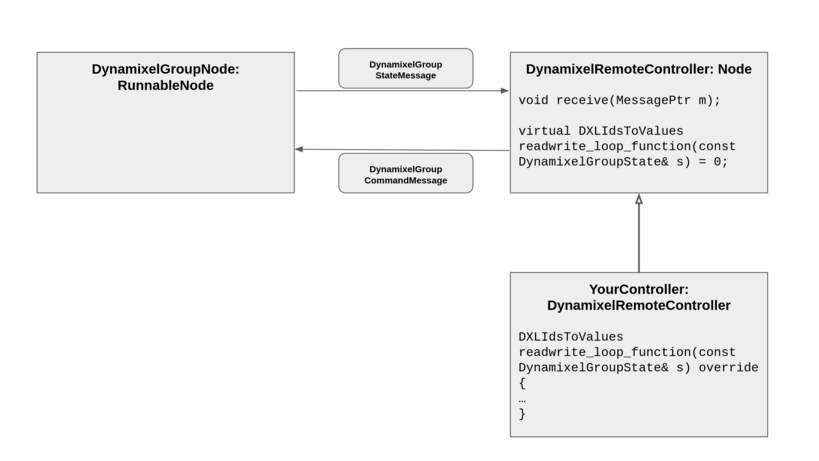

# roboflex.dynamixel

Support for Robotis' Dynamixel motor product line. Some of it anyway (tested on XH430-V350-R, XH430-W350, XM540-W270, others may work as well).

We provide two layers to controlling dynamixel motors:

* dynamixel_controller.h defines DynamixelGroupController: a controller for a group of dynamixels connected together (following Robotis' instructions), which uses no message passing or other roboflex functionality at all.
* dynamixel.h, which defines helper classes to control the above, using roboflex.

## DynamixelGroupController (see [dynamixel_controller.h](dynamixel_controller.h))

Controls a group of dynamixel motors, connected together according to Robotis' instructions, to create robot arms, pan-tilt controllers, and other robots. The DynamixelGroupController abstracts the repetitive part of the communication with the motors, and provides a convenient class that can control a group of motors through a callback function: a 'ReadWriteLoop' function. It calls this function synchronously with communication with the dynamixel motors, as fast as the interface can manage, depending on configured baud rate (think > 100hz).

This code is completely stand-alone; it uses nothing from roboflex.

Each dynamixel can have its own independent operation mode (current, position, velocity, etc), but this class makes it particularly easy to control groups of motors all in the same mode; see the constructors and static methods of DynamixelGroupController in [dynamixel_controller.h](dynamixel_controller.h).

Unless using the PositionController or VelocityController methods to instantiate a controller, the client must decide which control table entries to read and which to write. In general, you can write to the control table entries that are named DXLControlTable::Goal*, and read everything else. Refer to Robotis documentation for details.

## Roboflex additions (see [dynamixel.h](dynamixel.h))

This layer defines additional functionality to integrate with roboflex-style message passing. It defines Messages that encapsulate State and Command types, and several useful nodes. The first of these is DynamixelGroupNode. This node inherits RunnableNode; it is designed to be started and stopped. When instantiated, this node must be given an instance of a DynamixelGroupController. When started, it runs a ReadWriteLoopFunction on that instance inside its run_readwrite_loop method, using the last known GroupCommandMessage it has received, and then emits a GroupStateMessage.

We also provided DynamixelRemoteController. This is an abstract base class that requires implementation of the 'readwrite_loop_function' virtual method. Here is where your custom control logic would go. The benefit of this approach is that the DynamixelGroupNode can run in its own thread, and keep up with the motors. This node, then, can be run from anywhere, and using transport classes, the controller can even run on a totally separate computer.

We also provide DynamixelRemoteFrequencyController, which is exactly the same, but is driven at some frequency from a thread via inheritance from FrequencyGenerator.

## Troubleshooting

You might benefit from the Robotis Dynamixel Wizard program - just google for it.

If you can't access /dev/ttyUSB0, try this:

    sudo usermod -a -G dialout $USER
    sudo reboot
